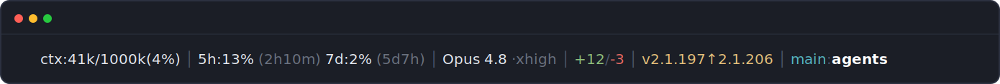

# Claude Code statusline

[](LICENSE)
[](https://claude.com/claude-code)


A richer status line for [Claude Code](https://claude.com/claude-code) — shows what the built-in bar leaves out.



```
ctx:41k/1000k(4%) │ 5h:13%↻2h10m 7d:2%↻5d7h │ Opus 4.8 ·xhigh │ +12/-3 │ v2.1.197↑2.1.206 │ main:agents
```

## Segments

| Segment | Meaning | Source field |
|---|---|---|
| `ctx:41k/1000k(4%)` | Context fill: tokens in context / window size / percent. Turns yellow ≥60%, red ≥80%. | `context_window.total_input_tokens`, `.context_window_size`, `.used_percentage` |
| `5h:13%↻2h10m 7d:2%↻5d7h` | Rate-limit usage for the 5-hour and 7-day windows, with `↻` time until each window resets | `rate_limits.*.used_percentage` / `.resets_at` |
| `Opus 4.8 ·xhigh` | Model family + version, and the reasoning effort level | `model.id`, `effort.level` |
| `+12/-3` | Lines added / removed this session | `cost.total_lines_added` / `.total_lines_removed` |
| `v2.1.197↑2.1.206` | Claude Code update indicator — **shown only when** a newer version exists on your release channel (yellow, `<current>↑<latest>`). Hidden when up to date. | `version` + release channel |
| `main:agents` | git branch : working-directory name | `git` + `workspace.current_dir` |

> Note: `context_window.total_input_tokens` is the real context fill. `current_usage.input_tokens` is only the *marginal* input of the last request (the rest sits in cache) — using it makes the token count read `0k`, which is the bug this script exists to avoid.

## Install

```bash
curl -fsSL https://raw.githubusercontent.com/sergekruf/claude-statusline/main/install.sh | bash
```

This downloads the script to `~/.claude/statusline-command.sh` and points `statusLine` in `~/.claude/settings.json` at it. Set `CLAUDE_CONFIG_DIR` first if your config lives elsewhere.

### Manual install

```bash
curl -fsSL https://raw.githubusercontent.com/sergekruf/claude-statusline/main/statusline-command.sh -o ~/.claude/statusline-command.sh
chmod +x ~/.claude/statusline-command.sh
```

Then add to `~/.claude/settings.json`:

```json
{
  "statusLine": { "type": "command", "command": "bash ~/.claude/statusline-command.sh" }
}
```

## Dependencies

- `jq` — required (parses the status JSON)
- `git` — optional, for the branch segment
- `curl` — optional, for the Claude Code update check

The panel re-renders every turn, so changes to the script take effect with no restart.

### Update check

The version segment compares your running version against the newest on **your release
channel** — `autoUpdatesChannel` from `settings.json`, defaulting to `stable`. It queries the
same source the native installer uses (`https://downloads.claude.ai/claude-code-releases/<channel>`),
so a `stable` install is never nagged about a `latest`-only release. (npm's `latest` tag tracks
the `latest` channel, which is why this does **not** use npm.)

The lookup runs **in the background at most once every 6 hours** and is cached to
`${XDG_CACHE_HOME:-~/.cache}/claude-statusline/latest-<channel>` — rendering only ever reads the
cache, so the panel never blocks on the network.

## License

[MIT](LICENSE)
